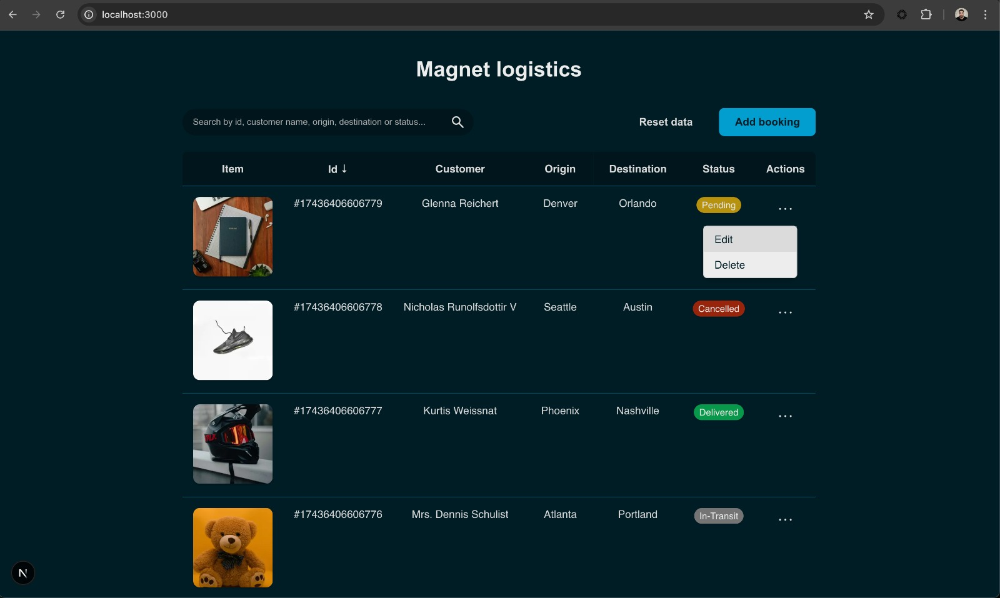
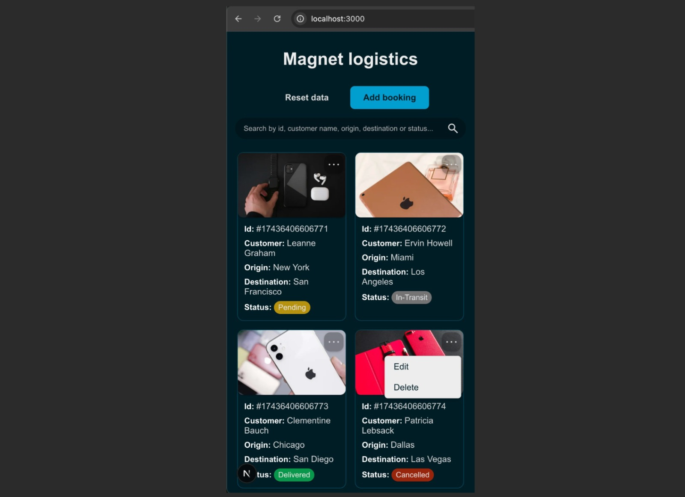

# Magnet Logistics

A responsive logistics dashboard built with **Next.js**, allowing users to view, add, edit, delete, and manage bookings with real-time updates and local storage persistence.





---

## ✨ Features

### 📄 Desktop View
- Displays a **table** of bookings with:
    - Booking ID
    - Customer Name
    - Origin
    - Destination
    - Status
    - Image (optional)
- Bookings can be **sorted** by all fields (ascending/descending).
- Each row includes a **menu** with actions:
    - **Edit**: Opens a modal with validated inputs.
    - **Delete**: Opens a confirmation modal.
- A top-right "**Add booking**" button opens a modal to create a new booking with validated fields.

### 📱 Mobile View
- Displays **booking cards** instead of a table for better responsiveness.
- Each card includes menu actions for edit/delete.

### ✏️ Forms
- Fields: Customer Name, Origin, Destination, Status, Image URL (optional)
- **Validation**: Required fields, minimum lengths, valid characters only.
- **Update button disabled** if no changes are made.

### ♻️ Reset Data
- Top right "Reset Data" button resets all bookings to original values.

---

## ⚙️ Stack & Libraries

### UI
- **No UI libraries used**
- All components (Button, Modal, Menu, etc.) are custom-built under `components/common/`

### Forms
- [**react-hook-form**](https://react-hook-form.com/) for form handling and validation

### Utilities
- [**classnames**](https://www.npmjs.com/package/classnames) for merging conditional class names

---

## 🧱 State & Persistence

### State Management
- `useReducer` + `createContext` for global state
- Available actions: `LOAD_BOOKINGS`, `CREATE_BOOKING`, `DELETE_BOOKING`, `UPDATE_BOOKING`
- Hook: `useBookings()` provides state + dispatch access

### Persistence
- Bookings are also stored in **localStorage**
- Hook: `useLoadInitialBookingsData()`
    - Loads data from localStorage if available
    - Otherwise fetches mock data from `https://jsonplaceholder.typicode.com/users`
- Hook: `useUpdateBookingsInLocalStorage()`
    - Syncs localStorage whenever bookings state changes
- Hook: `useResetBookingsData()`
    - Re-fetches data from API and resets both state and localStorage

---

## 📺 Demo
I shared a video demonstration and you can see it [clicking Here!](https://drive.google.com/file/d/1BRTTTzClfVJpFgJyqo1RoogBMlwLreLk/view?usp=sharing)


## 🪄 Deployed website
You can interact and test at the following Vercel URL:
- https://magnet-logistics.vercel.app/

## 🚀 Getting Started

### Install dependencies
```bash
npm install
```

### Run locally
```bash
npm run dev
```
Open [http://localhost:3000](http://localhost:3000) in your browser.

---

## 🔎 Test Requirements Completed

### Main
- [x] Display a list of bookings (id, customer name, origin, destination, status)
- [x] Use mock data (JSONPlaceholder)
- [x] Add a new booking
- [x] Input form with validations
- [x] Add booking in real-time (state + UI)
- [x] Edit a booking
- [x] Delete a booking
- [x] Modal for editing
- [x] Modal for confirming deletion

### Bonus
- [x] TypeScript
- [x] Filtering (search by multiple fields)
- [x] Sorting (asc/desc)
- [x] Responsive UI (desktop/tablet/mobile)

---

## 🌐 Deployment
This app is ready to be deployed using [Vercel](https://vercel.com) or any platform that supports Next.js.

## 👤 Author
- Cristian Pinzón - faykris28@gmail.com